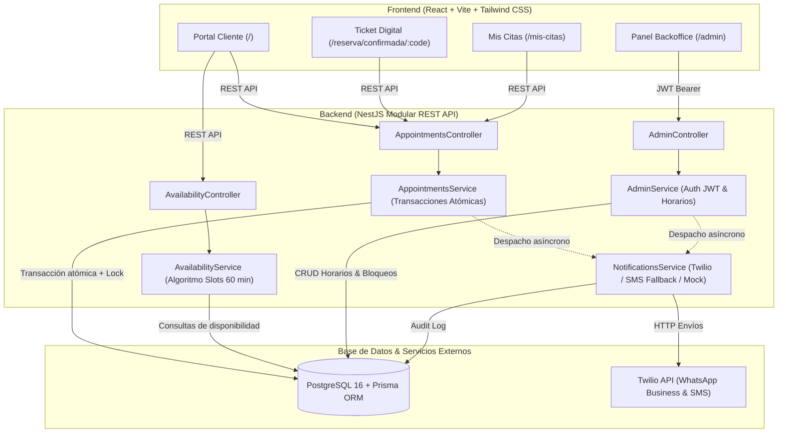

# BarberRed 💈 — Plataforma de Agendamiento para Barberías

> **Versión:** 1.0.0 (Release Oficial)  
> **Estado:** Producción / Verificado  
> **Metodología:** Spec-Driven Development (SDD)  
> **Licencia:** MIT / Propietaria  


---

## 📌 Descripción del Proyecto

**BarberRed** es una solución integral diseñada para modernizar la gestión de turnos y citas en barberías, eliminando el agendamiento manual por chats desordenados. Combina una experiencia de usuario rápida y sin fricción para el cliente final con un robusto panel de control backoffice para el administrador y barberos.

### ✨ Características Principales

#### 👤 Para los Clientes (Portal Web Público)
- **Reserva Guest sin Fricción:** Agendamiento en menos de 60 segundos sin necesidad de crear cuenta ni recordar contraseñas.
- **Selector Interactivo de Barbero y Fecha:** Calendario mensual dinámico con cálculo en tiempo real de slots disponibles en horas fijas en punto.
- **Ticket Digital Inmediato:** Código único de cita (`BR-XXXX`), exportación a Google Calendar / archivo `.ics` y enlace directo para compartir por WhatsApp.
- **Portal "Mis Citas":** Consulta de reservas activas e historial buscando por número de teléfono.
- **Reprogramación y Cancelación Autónoma:** El cliente puede cambiar su fecha/hora o cancelar su turno, protegido por una regla estricta de **2 horas mínimas de anticipación**.

#### 🛡️ Para la Administración (Backoffice `/admin`)
- **Autenticación Segura:** Acceso protegido por credenciales con hash bcrypt y sesiones basadas en JSON Web Tokens (JWT).
- **Aislamiento de Rutas:** El panel administrativo opera en `/admin`, oculto de la navegación pública del cliente.
- **Agenda Diaria Matricial:** Visualización de todas las citas del día agrupadas por barbero, hora y estado (`Confirmada`, `Cancelada por Admin`, `Cancelada por Cliente`, `Completada`).
- **Bloqueo Flexible de Horarios:** Bloqueo de horas individuales o jornadas completas (feriados, descansos, cierres por mantención), configurable tanto para un barbero individual como **para todos los barberos simultáneamente**.
- **Cancelación con Notificación:** Cancelación administrativa de turnos indicando motivo obligatorio.
- **Auditoría de Notificaciones:** Registro histórico en tiempo real de todos los mensajes despachados vía WhatsApp o SMS con detalles de entrega.

#### ⚡ Motor y Robustez Técnica
- **Transacciones Atómicas y Bloqueo Pesimista:** Control de concurrencia atómico con `SELECT ... FOR UPDATE` e índices únicos parciales en PostgreSQL para garantizar que nunca ocurra una doble reserva (*overbooking*), probado con benchmarks de carga simultánea.
- **Módulo Transaccional Híbrido:** Notificaciones automáticas por WhatsApp con fallback a SMS vía Twilio. Detecta automáticamente modo simulado en desarrollo local para no generar costos.

---

## 🏗️ Arquitectura del Sistema



---

## 🚀 Guía de Inicio Rápido

### Requisitos Previos
- **Docker Desktop** (en ejecución).
- **Node.js** v20+ o v24+.

---

### Opción A: Modo Desarrollo Local

1. **Iniciar la base de datos (PostgreSQL en Docker):**
   ```bash
   docker compose up -d
   ```

2. **Configurar e iniciar el Backend:**
   ```bash
   cd backend
   cp .env.example .env     # (Opcional, ya preconfigurado)
   npm install
   npx prisma migrate dev
   npx tsx prisma/seed.ts   # Carga barberos y admin inicial
   npm run start:dev
   ```
   > Backend disponible en: [http://localhost:3000/api](http://localhost:3000/api)

3. **Configurar e iniciar el Frontend:**
   ```bash
   cd ../frontend
   npm install
   npm run dev
   ```
   > Aplicación Web disponible en: [http://localhost:5173](http://localhost:5173)  
   > Panel de Administración disponible en: [http://localhost:5173/admin](http://localhost:5173/admin)

---

### Opción B: Despliegue con Docker Compose (Producción)

Para levantar el stack completo (Base de datos + API NestJS + Frontend en Nginx) en un solo comando:

```bash
docker compose -f docker-compose.prod.yml up -d --build
```

- **Frontend:** [http://localhost](http://localhost) (puerto 80)
- **Backend API:** [http://localhost:3000/api](http://localhost:3000/api)
- **Base de Datos:** `localhost:5432`

---

## 🔑 Credenciales por Defecto (Entorno de Pruebas)

| Rol | Correo / Usuario | Contraseña | URL de Acceso |
| :--- | :--- | :--- | :--- |
| **Administrador Principal** | `admin@barberred.com` | `Admin123!` | [http://localhost:5173/admin](http://localhost:5173/admin) |
| **Cliente / Público** | *No requiere registro* | *N/A* | [http://localhost:5173](http://localhost:5173) |

---

## 🧪 Estrategia de Pruebas y Control de Calidad

### 1. Pruebas Unitarias (Vitest)
Ejecuta la suite completa de 16 tests automatizados para validar disponibilidad, cálculo de slots, validaciones de fecha y despacho de notificaciones:

```bash
cd backend
npm test
```

### 2. Benchmark de Concurrencia y Resistencia a Colisiones
Simula **10 clientes reservando exactamente el mismo segundo el mismo slot** para verificar la exclusión mutua (`HTTP 201` para el primero y `HTTP 409 Conflict` para los 9 restantes):

```bash
cd backend
npm run test:concurrency
```

---

## 📂 Estructura del Repositorio

```text
├── backend/                   # API REST con NestJS y Prisma
│   ├── prisma/
│   │   ├── schema.prisma      # Modelos de datos (Barber, Appointment, ScheduleBlock, etc.)
│   │   ├── seed.ts            # Script de inicialización de datos
│   │   └── migrations/        # Historial de migraciones SQL
│   ├── scripts/
│   │   └── test-concurrency.ts # Script de carga concurrente (T-5.2)
│   ├── src/
│   │   ├── admin/             # Módulo de Autenticación JWT y Backoffice
│   │   ├── appointments/      # Lógica de Reservas, Modificación y Cancelación
│   │   ├── availability/      # Algoritmo de cálculo de slots de 60 min
│   │   ├── barbers/           # Catálogo de barberos
│   │   └── notifications/     # Integración Twilio (WhatsApp/SMS) y auditoría
│   └── Dockerfile             # Multi-stage build de producción para NestJS
│
├── frontend/                  # SPA con React, Vite y Tailwind CSS
│   ├── src/
│   │   ├── components/
│   │   │   ├── admin/         # Vistas del Backoffice (Agenda, Horarios, Notificaciones)
│   │   │   ├── appointments/  # Componentes de búsqueda, reprogramación y cancelación
│   │   │   ├── booking/       # Flujo de agendamiento (BarberCard, DatePicker, DigitalTicket)
│   │   │   └── common/        # Badges y elementos compartidos
│   ├── nginx.conf             # Servidor web Nginx para producción
│   └── Dockerfile             # Multi-stage build Nginx para React
│
├── sdd/mvp/                   # Especificaciones de Spec-Driven Development
│   ├── functional-spec.md     # Criterios de Aceptación Gherkin
│   ├── technical-spec.md      # Contratos de API y Diagramas ER
│   ├── design-reference.md    # Tokens de diseño y colores
│   └── development-plan.md    # Cronograma y estado de fases (WBS)
│
├── docker-compose.yml         # Contenedor de PostgreSQL para desarrollo local
├── docker-compose.prod.yml    # Orquestación de producción completa (DB + API + Nginx)
└── README.md                  # Documentación oficial del proyecto
```

---

## 📄 Licencia y Autores
Desarrollado para el proyecto **BarberRed MVP**.  
Metodología **Spec-Driven Development (SDD)** completada con éxito.
