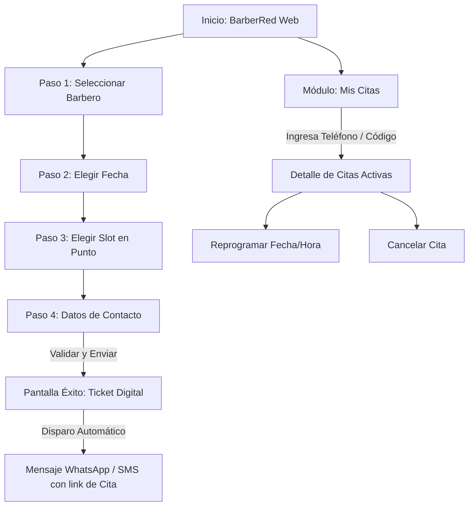

# Design Reference (design-reference.md)
## Proyecto: BarberRed (MVP)

**Versión:** 1.0.0  
**Estado:** Definido  
**Fecha:** 2026-09-08  
**Metodología:** Spec-Driven Development (SDD)  
**Ubicación:** `/sdd/mvp/design-reference.md`  
**Documentos Relacionados:** [`functional-spec.md`](file:///C:/Users/estee/Documents/Proyectos/Antigravity/prueba/sdd/mvp/functional-spec.md) | [`technical-spec.md`](file:///C:/Users/estee/Documents/Proyectos/Antigravity/prueba/sdd/mvp/technical-spec.md)

---

## 1. Identidad Visual y Filosofía de Diseño

**BarberRed** adopta una estética moderna, urbana y premium inspirada en la atmósfera de las barberías tradicionales contemporáneas:
- **Tema Oscuro Dominante (*Dark Mode Native*):** Fondos carbón/pizarra oscuro que transmiten sobriedad y elegancia, combinados con acentos vibrantes en color rojo carmesí (*Barber Red*).
- **Enfoque Mobile-First:** El 85%+ de los clientes agendarán desde sus teléfonos inteligentes a través de links compartidos en redes sociales o WhatsApp. Todos los componentes táctiles respetan un área mínima de toque de $48 \times 48 \text{ px}$.
- **Cero Fricción Cognitiva:** El flujo de agendamiento se organiza en pasos lineales y evidentes: *¿Quién te atiende? $\rightarrow$ ¿Qué día? $\rightarrow$ ¿A qué hora? $\rightarrow$ ¿Quién eres?*.

---

## 2. Sistema de Diseño (Design Tokens en Tailwind CSS)

### 2.1 Paleta Cromática

| Propósito | Nombre Token | Hex Code | Clase Tailwind | Uso |
| :--- | :--- | :--- | :--- | :--- |
| **Fondo Principal** | `bg-base` | `#0F172A` | `bg-slate-900` | Fondo general de la aplicación |
| **Fondo Superficies** | `bg-surface` | `#1E293B` | `bg-slate-800` | Tarjetas, modales, barras laterales |
| **Bordes y Divisores**| `border-subtle`| `#334155` | `border-slate-700` | Contornos de slots, inputs y separadores |
| **Primario / Acento** | `brand-red` | `#DC2626` | `bg-red-600` | Botones de acción principal (CTA), selección activa |
| **Primario Hover** | `brand-red-hover`| `#B91C1C` | `hover:bg-red-700` | Estado hover de botones primarios |
| **Texto Principal** | `text-primary` | `#F8FAFC` | `text-slate-50` | Títulos y etiquetas de alta prioridad |
| **Texto Secundario** | `text-muted` | `#94A3B8` | `text-slate-400` | Subtítulos, horas inactivas, notas |
| **Estado: Éxito** | `success` | `#16A34A` | `text-emerald-600` | Cita confirmada, WhatsApp enviado |
| **Estado: Alerta** | `warning` | `#F59E0B` | `text-amber-500` | Advertencia de cancelación (< 2h) |
| **Estado: Error** | `danger` | `#EF4444` | `text-red-500` | Errores de validación, slot colisionado |

### 2.2 Tipografía
- **Fuente Principal:** Inter (`font-sans`), sans-serif limpia y geométrica.
- **Títulos de Impacto:** Oswald o Montserrat en mayúsculas para encabezados clave (`tracking-wide font-bold`).
- **Números y Horas:** Monospace legible (`font-mono`) para los códigos de cita (`BR-9421`) y los slots (`10:00`, `11:00`).

---

## 3. Flujo de Usuario y Wireframes de Componentes

### 3.1 Diagrama de Navegación del Cliente


---

### 3.2 Wireframe: Selector de Slots Horarios (`SlotPicker`)
Los horarios se presentan en una grilla interactiva en horas exactas (cada bloque representa 45 min servicio + 15 min buffer):

```text
┌─────────────────────────────────────────────────────────────┐
│ 📅 Selecciona tu hora para el Viernes 12 de Septiembre     │
│ Barbero: Carlos "El Navaja"                                 │
├─────────────────────────────────────────────────────────────┤
│                                                             │
│   [ 10:00 ]       [ 11:00 ]       [ 12:00 ]       [ 13:00 ] │
│   (Disponible)    (Disponible)    (Ocupado)       (Disponible)│
│                                                             │
│   [ 14:00 ]       [ 15:00 ]       [ 16:00 ]       [ 17:00 ] │
│   (Descanso)      (Disponible)    (Disponible)    (Disponible)│
│                                                             │
│   [ 18:00 ]       [ 19:00 ]                                 │
│   (Disponible)    (Ocupado)                                 │
│                                                             │
├─────────────────────────────────────────────────────────────┤
│ Turno seleccionado: 15:00 hrs (Duración: 45 min + 15 buffer)│
│ [ CONTINUAR CON MIS DATOS -> ]                              │
└─────────────────────────────────────────────────────────────┘
```

#### Estados del Botón de Slot:
1. **Disponible:** Borde `border-slate-700`, fondo `bg-slate-800`, texto blanco. Hover en `border-red-500`.
2. **Seleccionado:** Fondo `bg-red-600`, texto blanco audaz, sombra `shadow-lg shadow-red-500/30`.
3. **Ocupado / Deshabilitado:** Fondo `bg-slate-900`, borde `border-slate-800`, texto tachado o atenuado `text-slate-600`, cursor `not-allowed`.

---

### 3.3 Wireframe: Formulario de Reserva (Guest Checkout)
Diseñado para completarse con una sola mano en dispositivos móviles:

```text
┌─────────────────────────────────────────────────────────────┐
│ ✂️ Confirma tu Cita en BarberRed                            │
├─────────────────────────────────────────────────────────────┤
│ Resumen:                                                    │
│ 💈 Barbero: Carlos "El Navaja"                              │
│ 📆 Fecha: Viernes 12 de Septiembre, 15:00 hrs               │
├─────────────────────────────────────────────────────────────┤
│ Tu Nombre Completo *                                        │
│ ┌─────────────────────────────────────────────────────────┐ │
│ │ Juan Pérez                                              │ │
│ └─────────────────────────────────────────────────────────┘ │
│                                                             │
│ Tu Teléfono Celular (para confirmar por WhatsApp) *         │
│ ┌─────────────────────────────────────────────────────────┐ │
│ │ 🇨🇱 +56 9 8765 4321                                      │ │
│ └─────────────────────────────────────────────────────────┘ │
│                                                             │
│ Correo Electrónico (opcional)                               │
│ ┌─────────────────────────────────────────────────────────┐ │
│ │ juan.perez@email.com                                    │ │
│ └─────────────────────────────────────────────────────────┘ │
│                                                             │
│ [ 💈 CONFIRMAR RESERVA ]                                   │
│ 🔒 No requiere crear cuenta ni ingresar contraseñas         │
└─────────────────────────────────────────────────────────────┘
```

---

### 3.4 Wireframe: Ticket de Confirmación Exitosa
Tras confirmar, se muestra el comprobante y opciones directas:

```text
┌─────────────────────────────────────────────────────────────┐
│                   🎉 ¡CITA CONFIRMADA!                      │
│                                                             │
│              Código de Reserva:  BR-7429                   │
│                                                             │
│ ┌─────────────────────────────────────────────────────────┐ │
│ │ Barbero: Carlos "El Navaja"                             │ │
│ │ Fecha: Viernes 12 de Septiembre                         │ │
│ │ Horario: 15:00 a 16:00 (Atención: 45 min)               │ │
│ │ Cliente: Juan Pérez (+56 9 8765 4321)                   │ │
│ │ Estado: Confirmada                                      │ │
│ └─────────────────────────────────────────────────────────┘ │
│                                                             │
│ 💬 Te enviamos un mensaje por WhatsApp con los detalles.   │
│                                                             │
│ [ 📲 ABRIR WHATSAPP ]      [ 📅 AGREGAR A GOOGLE CALENDAR ] │
│                                                             │
│ ¿Necesitas cancelar o cambiar de hora?                      │
│ Puedes hacerlo en cualquier momento hasta 2h antes aquí:    │
│ [ Gestionar / Cancelar Cita ]                               │
└─────────────────────────────────────────────────────────────┘
```

---

### 3.5 Wireframe: Panel de Administración Backoffice (`/admin`)

```text
┌────────────────────────────────────────────────────────────────────────┐
│ BARBERRED ADMIN  | 📅 Agenda  | ⏰ Horarios & Bloqueos | 👥 Barberos   │
├────────────────────────────────────────────────────────────────────────┤
│ Fecha: [ < 12/09/2026 > ]   | Filtrar Barbero: [ Todos los barberos ▾] │
├────────────┬─────────────────────────┬─────────────────┬───────────────┤
│ HORA       │ CARLOS "EL NAVAJA"      │ MATÍAS FADE     │ ESTADO SLOT   │
├────────────┼─────────────────────────┼─────────────────┼───────────────┤
│ 10:00      │ Juan Pérez (Confirmado) │ [ Libre ]       │ 1 Ocupado     │
│ 11:00      │ Andrés Gomez (Confirm.) │ Diego M. (Conf.)│ Completo      │
│ 12:00      │ [ BLOQUEADO - Almuerzo ]│ [ Libre ]       │ 1 Bloqueado   │
│ 13:00      │ [ Libre ]               │ [ Libre ]       │ 2 Libres      │
│ 14:00      │ Roberto Díaz            │ [ Libre ]       │ 1 Ocupado     │
│ ...        │ ...                     │ ...             │ ...           │
├────────────┴─────────────────────────┴─────────────────┴───────────────┤
│ Acciones Rápidas:                                                      │
│ [+ Bloquear Día Completo]   [+ Bloquear Franja Horaria]   [Ver Logs SMS]│
└────────────────────────────────────────────────────────────────────────┘
```

---

## 4. Lineamientos de Accesibilidad (a11y) y Rendimiento UI

1. **Contraste de Color:** Ratios mínimos de $4.5:1$ en todos los textos sobre fondos oscuros (cumplimiento WCAG 2.1 nivel AA).
2. **Navegación por Teclado:** Toda la selección de barberos, días y slots horarias es completamente operable con `Tab`, flechas direccionales y `Enter / Space`.
3. **Feedback Inmediato & Estados de Carga:**
   - *Skeleton loaders* en el calendario mientras consulta disponibilidad a NestJS.
   - Deshabilitación con spinner en el botón de confirmación para impedir envíos dobles por clicks reiterados.
4. **Validación de Formularios en Vivo:** Validación de número telefónico en tiempo real utilizando expresiones regulares según el código de país.
