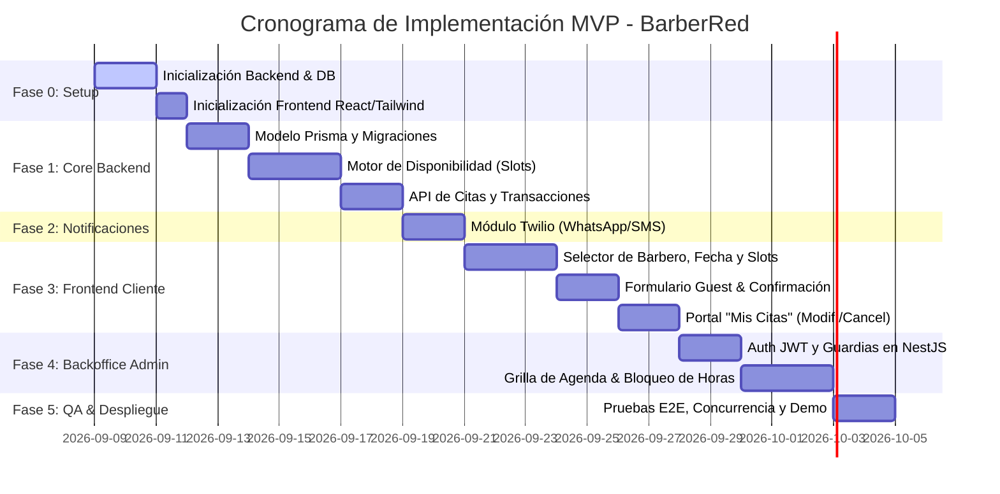

# Development Plan (development-plan.md)
## Proyecto: BarberRed (MVP)

**Versión:** 1.0.0  
**Estado:** Listo para Ejecución  
**Fecha:** 2026-09-08  
**Metodología:** Spec-Driven Development (SDD)  
**Ubicación:** `/sdd/mvp/development-plan.md`  
**Documentos Base:** [`functional-spec.md`](file:///C:/Users/estee/Documents/Proyectos/Antigravity/prueba/sdd/mvp/functional-spec.md) | [`technical-spec.md`](file:///C:/Users/estee/Documents/Proyectos/Antigravity/prueba/sdd/mvp/technical-spec.md) | [`design-reference.md`](file:///C:/Users/estee/Documents/Proyectos/Antigravity/prueba/sdd/mvp/design-reference.md)

---

## 1. Enfoque y Metodología de Ejecución

El desarrollo del MVP de **BarberRed** se implementará siguiendo la metodología **Spec-Driven Development (SDD)**:
- Cada funcionalidad se implementa cumpliendo estrictamente con los criterios de aceptación Gherkin definidos en `functional-spec.md`.
- El backend en **NestJS** y la base de datos **PostgreSQL + Prisma** se construyen como fuente única de verdad antes de acoplar las interfaces visuales.
- El frontend en **React + Tailwind CSS** consume los contratos de API tipados definidos en `technical-spec.md`.

---

## 2. Fases de Desarrollo y Desglose de Tareas (WBS)

---

### Fase 0: Configuración del Entorno y Estructura Base
- **T-0.1:** Inicializar repositorio con estructura monorepo (`/backend` y `/frontend`).
- **T-0.2:** Configurar proyecto **NestJS** con TypeScript, ESLint, Prettier y soporte para variables de entorno (`@nestjs/config`).
- **T-0.3:** Configurar proyecto **React** con Vite, TypeScript y **Tailwind CSS**, integrando la paleta de colores y tokens de `design-reference.md`.
- **T-0.4:** Configurar contenedor Docker para **PostgreSQL** local y conectar Prisma CLI.

---

### Fase 1: Base de Datos, Motor de Slots y API Central (Backend)
- **T-1.1:** Escribir el archivo `prisma/schema.prisma` con las tablas: `Barber`, `WorkingHour`, `ScheduleBlock`, `Appointment`, `NotificationLog`, `AdminUser`.
- **T-1.2:** Ejecutar migración inicial (`prisma migrate dev`) y crear script de seed con datos iniciales de barberos y horarios estándar (10:00 a 19:00).
- **T-1.3:** Implementar `AvailabilityService` (Algoritmo de cálculo de slots de 60 min: 45 min atención + 15 min buffer en horas fijas en punto).
- **T-1.4:** Implementar endpoint público `GET /api/barbers` y `GET /api/availability`.
- **T-1.5:** Implementar `AppointmentsService` con transacción atómica en Prisma (`$transaction`) para reservas sin colisiones y generación del código único de cita (`BR-XXXX`).
- **T-1.6:** Implementar endpoints de consulta, modificación de fecha/hora y cancelación para el cliente (`GET /api/appointments/:code`, `PATCH .../reschedule`, `POST .../cancel`).

---

### Fase 2: Integración de Notificaciones Transaccionales (Twilio)
- **T-2.1:** Configurar cliente Twilio en NestJS (`NotificationsModule`) con credenciales de entorno (`TWILIO_ACCOUNT_SID`, `TWILIO_AUTH_TOKEN`, etc.).
- **T-2.2:** Diseñar plantillas de mensajes (Confirmación, Modificación, Cancelación) para WhatsApp Business.
- **T-2.3:** Implementar despacho asíncrono con fallback automático a SMS si falla WhatsApp.
- **T-2.4:** Registro de auditoría en la tabla `NotificationLog`.

---

### Fase 3: Experiencia de Usuario Web Cliente (Frontend)
- **T-3.1:** Crear componentes UI reutilizables: `BarberCard`, `DatePicker`, `SlotButton`, `StatusBadge`.
- **T-3.2:** Construir flujo de reserva paso a paso en la vista principal (`/`):
  - Selección de barbero $\rightarrow$ Selección de día $\rightarrow$ Grilla interactiva de slots en punto.
- **T-3.3:** Construir formulario modal/drawer de confirmación (Guest Checkout: Nombre, Teléfono celular con prefijo internacional, Email opcional).
- **T-3.4:** Construir pantalla de ticket digital exitoso (`/reserva/confirmada/:code`) con acceso directo a WhatsApp y descarga a calendario.
- **T-3.5:** Desarrollar vista `/mis-citas` con búsqueda por teléfono/código y modal de cancelación/reprogramación con alerta de ventana mínima de 2h.

---

### Fase 4: Panel Backoffice Administrativo
- **T-4.1:** Implementar autenticación administrativa con JWT, bcrypt y guardias (`JwtAuthGuard`, `RolesGuard`) en NestJS.
- **T-4.2:** Construir vista de Login en `/admin/login`.
- **T-4.3:** Construir grilla o calendario interactivo diario `/admin/agenda` mostrando citas por barbero y estados (`CONFIRMED`, `CANCELLED_ADMIN`, etc.).
- **T-4.4:** Construir interfaz para habilitar/deshabilitar días festivos y bloquear horas específicas por barbero (`/admin/disponibilidad`).
- **T-4.5:** Implementar botón de cancelación administrativa con campo de motivo y disparo de notificación al cliente.

---

### Fase 5: Estrategia de Pruebas, Control de Calidad y Cierre
- **T-5.1 Pruebas Unitarias:**
  - Tests unitarios en Jest para el cálculo de slots en `AvailabilityService` (validar que no solape horas, que respete descansos y bloqueos de día completo).
- **T-5.2 Pruebas de Concurrencia:**
  - Script de test de carga simultánea disparando 10 reservas en paralelo para el mismo slot; verificar que exactamente 1 sea confirmada y las 9 restantes reciban HTTP 409 Conflict.
- **T-5.3 Pruebas de Notificación:**
  - Prueba de entrega de mensajes WhatsApp en entorno sandbox de Twilio.
- **T-5.4 Verificación de Diseño y Responsive:**
  - Validación visual en viewports móviles (375px, 414px) y escritorio (1280px+).

---

## 3. Matriz de Riesgos y Mitigaciones

| Riesgo Técnico / Operativo | Severidad | Probabilidad | Estrategia de Mitigación |
| :--- | :---: | :---: | :--- |
| **Colisión de reservas simultáneas** | Alta | Media | Transacciones aisladas en Prisma (`$transaction`) y validación estricta de estado en base de datos. |
| **Fallas en la entrega de WhatsApp (Twilio)** | Media | Media | Fallback transparente a SMS convencional y almacenamiento del estado en `NotificationLog`. |
| **Cliente no asiste al turno (No-show)** | Media | Alta | El mensaje de WhatsApp incluye enlace directo para cancelar o reprogramar hasta 2h antes; mitigable en fase 2 con cobro de seña. |
| **Husos horarios confusos** | Media | Baja | Todas las fechas y horas se procesan y almacenan en hora local de la barbería (ej. `America/Santiago`). |

---

## 4. Definición de Hecho (Definition of Done - DoD)

Una funcionalidad o historia de usuario se considera **completada** para el MVP únicamente cuando:
1. Satisface el 100% de los criterios de aceptación Gherkin definidos en `functional-spec.md`.
2. Cumple con los tipos y contratos de endpoints definidos en `technical-spec.md`.
3. Adhiere a los lineamientos visuales y de accesibilidad de `design-reference.md`.
4. Cuenta con pruebas unitarias o de integración aprobadas.
5. El código compila limpiamente sin errores de TypeScript ni advertencias críticas de linter.
