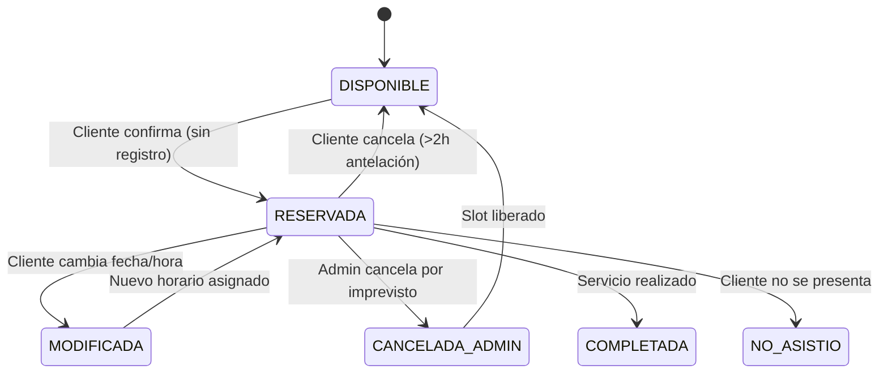

# Functional Specification (functional-spec.md)
## Proyecto: BarberRed (MVP)

**Versión:** 1.1.0  
**Estado:** Aprobado / Especificado  
**Fecha:** 2026-09-08  
**Metodología:** Spec-Driven Development (SDD)  
**Ubicación:** `/sdd/mvp/functional-spec.md`  

---

## 1. Resumen Ejecutivo y Visión del Producto

### 1.1 Propósito
**BarberRed** es una plataforma digital de agendamiento de turnos para barberías diseñada para automatizar la reserva de citas, optimizar la ocupación de los barberos y facilitar la administración diaria del local sin fricciones de registro obligatorio para el cliente final.

### 1.2 Objetivos del MVP
- Permitir a los clientes reservar turnos en horarios fijos (en punto) de forma ágil, sin requerir registro previo con contraseña (*guest flow*).
- Facilitar al cliente la consulta, modificación y cancelación de sus citas activas mediante su número de teléfono o código alfanumérico único de reserva.
- Integrar notificaciones transaccionales inmediatas vía WhatsApp / SMS (mediante API de mensajería como Twilio) para confirmar citas, avisar cancelaciones o modificaciones.
- Dotar al dueño/administrador de un panel de control backoffice para configurar la jornada diaria (hora de inicio X a hora de fin Z), habilitar/deshabilitar días y horas, ver la agenda completa y gestionar excepciones operativas.

---

## 2. Actores y Roles del Sistema

| Rol | Descripción | Permisos Clave |
| :--- | :--- | :--- |
| **Cliente / Usuario Final** | Persona que agenda un turno en la barbería. | - Reservar citas sin registrar cuenta. - Consultar turnos activos con su teléfono/código. - Modificar fecha/hora de su cita activa. - Cancelar cita con antelación mínima. |
| **Barbero (Staff)** | Profesional que atiende a los clientes. | - Consultar su grilla de turnos asignados por día/semana. - Visualizar datos de contacto y notas del cliente atendido. |
| **Administrador / Dueño** | Responsable de la gestión comercial y operativa. | - Acceso autenticado al Backoffice (`/admin`). - Habilitar/deshabilitar días (feriados, descansos). - Bloquear franjas horarias específicas por barbero. - Visualizar y filtrar todas las reservas. - Cancelar o reprogramar citas con aviso al cliente. |

---

## 3. Alcance del MVP (Scope)

### 3.1 Dentro del Alcance (In-Scope)
1. **Flujo de Agendamiento Sin Registro (Guest Flow):**
   - Selección de barbero (o cualquier barbero disponible).
   - Selección de fecha dentro de la ventana habilitada (ej. hasta 30 días futuros).
   - Selección de slots horarios precalculados en horas exactas (ej. 10:00, 11:00, 12:00, etc.).
   - Formulario de reserva: Nombre completo, Teléfono celular (para WhatsApp/SMS) y Correo electrónico opcional/secundario.
2. **Estructura de Horarios y Turnos Fijos:**
   - Bloque estándar de **60 minutos totales**: **45 minutos de atención efectiva + 15 minutos de buffer** para limpieza/descanso/demoras.
   - Horarios de inicio alineados a horas exactas (ej. 10:00, 11:00, 12:00 ... 19:00).
3. **Gestión Autónoma de Citas por el Cliente:**
   - Módulo "Mis Citas" con búsqueda por número telefónico o código de reserva.
   - Cancelación de cita (respetando ventana mínima de 2 horas).
   - Reprogramación/Modificación de fecha/hora manteniendo los datos del cliente.
4. **Notificaciones Automatizadas:**
   - Envío de confirmación inmediata por WhatsApp / SMS al agendar exitosamente.
   - Envío de alerta por WhatsApp / SMS si la cita es cancelada o modificada (por el cliente o por el local).
5. **Panel Administrativo Backoffice:**
   - Autenticación con usuario/contraseña para el administrador.
   - Configuración de horarios operativos diarios de la barbería (de hora $X$ a hora $Z$).
   - Grilla interactiva para habilitar/deshabilitar días completos o slots puntuales de un barbero.
   - Vista de agenda en lista y calendario.

### 3.2 Fuera del Alcance (Out-of-Scope para MVP)
- Pasarela de cobro online anticipado (el pago se efectúa presencialmente en el local).
- Cuentas de usuario con contraseña para clientes (se prioriza cero fricción).
- Múltiples sucursales o franquicias (foco en una barbería física).
- Selección de catálogo complejo de múltiples servicios con duraciones irregulares.

---

## 4. Historias de Usuario y Criterios de Aceptación (Gherkin)

### Épica 1: Experiencia del Cliente

#### US-01: Selección de Barbero, Día y Hora en Punto
> **Como** cliente de BarberRed  
> **Quiero** ver los horarios en horas exactas disponibles para cada barbero  
> **Para** elegir fácilmente la hora de mi atención sin confusiones de minutos.

- **Criterio 1.1 (Slots en horas fijas):**
  - **Given** que la barbería opera de 10:00 a 19:00,
  - **When** el cliente selecciona una fecha válida y un barbero,
  - **Then** los turnos disponibles se presentan en horas exactas (`10:00`, `11:00`, `12:00`, `13:00`, etc.), contemplando internamente 45 min de servicio y 15 min de margen.
- **Criterio 1.2 (Ocultamiento de horas tomadas):**
  - **Given** que el slot de las 15:00 ya fue reservado o bloqueado por el administrador,
  - **When** otro cliente consulta ese mismo día y barbero,
  - **Then** el botón de las 15:00 aparece deshabilitado o marcado como no disponible.

#### US-02: Confirmación de Cita sin Registro y Notificación WhatsApp/SMS
> **Como** cliente  
> **Quiero** reservar mi turno con solo mi nombre y teléfono celular  
> **Para** agendar en menos de 1 minuto y recibir mi confirmación al instante.

- **Criterio 2.1 (Reserva exitosa):**
  - **Given** que el cliente seleccionó barbero, día y slot de hora fija,
  - **When** ingresa su nombre, número telefónico móvil y confirma,
  - **Then** el sistema genera un código de cita único (ej. `BR-8921`), bloquea el slot atómicamente y dispara un mensaje de WhatsApp/SMS con el detalle y enlace de gestión.
- **Criterio 2.2 (Control de concurrencia):**
  - **Given** dos clientes intentando reservar la misma hora simultáneamente,
  - **When** se procesa la confirmación en backend,
  - **Then** la primera solicitud adquiere el turno y la segunda recibe una notificación inmediata para escoger otro horario disponible.

#### US-03: Consulta, Modificación y Cancelación de Citas
> **Como** cliente  
> **Quiero** poder consultar, reprogramar o cancelar mi cita desde mi teléfono  
> **Para** gestionar imprevistos sin necesidad de llamar por teléfono a la barbería.

- **Criterio 3.1 (Acceso a la cita):**
  - **Given** un cliente con una reserva activa,
  - **When** ingresa su número de teléfono en el buscador de "Mis Citas" o accede mediante el enlace recibido por WhatsApp,
  - **Then** visualiza los datos de su cita actual (Barbero, Fecha, Hora, Estado).
- **Criterio 3.2 (Reprogramación / Modificación):**
  - **Given** que faltan más de 2 horas para la cita,
  - **When** el cliente selecciona "Modificar Cita" y escoge un nuevo día/hora disponible,
  - **Then** el sistema libera el slot anterior, asigna el nuevo horario y envía una notificación por WhatsApp/SMS con la actualización.
- **Criterio 3.3 (Cancelación):**
  - **Given** que faltan más de 2 horas para el turno,
  - **When** el cliente presiona "Cancelar Cita" y confirma,
  - **Then** el turno queda en estado `CANCELADO_CLIENTE`, el slot se libera de inmediato y se despacha el mensaje de cancelación.

---

### Épica 2: Panel Administrativo / Dueño

#### US-04: Autenticación Administrativa
> **Como** administrador de BarberRed  
> **Quiero** iniciar sesión con credenciales seguras  
> **Para** controlar la disponibilidad y supervisar todas las citas.

- **Criterio 4.1:**
  - **Given** un usuario no autenticado en `/admin`,
  - **When** intenta ver las citas o configuración,
  - **Then** es redirigido a `/admin/login` exigiendo email y contraseña válidos.

#### US-05: Gestión de Horarios y Bloqueos
> **Como** administrador  
> **Quiero** definir la jornada diaria (ej. de 09:00 a 20:00) y deshabilitar días o slots específicos  
> **Para** reflejar feriados, descansos o ausencias de barberos.

- **Criterio 5.1 (Apertura y cierre):**
  - **Given** el panel de configuración horaria,
  - **When** el administrador define la jornada de atención de hora $X$ a hora $Z$,
  - **Then** el generador de slots solo produce horarios dentro de ese intervalo.
- **Criterio 5.2 (Bloqueo puntual):**
  - **Given** un barbero que necesita salir a las 14:00,
  - **When** el administrador marca el slot 14:00 como "Bloqueado",
  - **Then** ningún cliente podrá seleccionar esa hora en la web pública.

#### US-06: Visualización de Citas y Cancelación Administrativa
> **Como** administrador  
> **Quiero** ver la agenda global del día y poder cancelar un turno si surge una urgencia  
> **Para** mantener el control de la barbería e informar al cliente afectado.

- **Criterio 6.1:**
  - **Given** la vista de calendario o tabla en `/admin/agenda`,
  - **When** el administrador cancela una cita con un motivo justificado,
  - **Then** el turno cambia a `CANCELADO_ADMIN` y se envía automáticamente un SMS/WhatsApp al cliente notificándole la cancelación.

---

## 5. Reglas de Negocio (Business Rules)

| Código | Nombre de Regla | Detalle |
| :--- | :--- | :--- |
| **RN-01** | **Estructura del Slot** | Cada slot dura 60 minutos: 45 min servicio + 15 min buffer. Inician estrictamente en hora en punto (`HH:00`). |
| **RN-02** | **Jornada Configurable** | Los slots se generan dinámicamente entre la hora de apertura $X$ y la hora de cierre $Z$ configuradas. |
| **RN-03** | **No Solapamiento** | Un barbero no puede tener más de una reserva confirmada o bloqueada en el mismo slot. |
| **RN-04** | **Antelación de Reserva** | Mínimo 1 hora de anticipación para agendar el mismo día. Máximo 30 días hacia el futuro. |
| **RN-05** | **Ventana de Modificación/Cancelación** | El cliente solo puede modificar o cancelar su cita con al menos 2 horas de antelación al inicio del turno. |
| **RN-06** | **Unicidad de Contacto por Horario** | Un mismo número de teléfono no puede reservar dos citas a la misma hora con distintos barberos. |
| **RN-07** | **Notificación Obligatoria** | Todo cambio de estado (Confirmada, Modificada, Cancelada) dispara un evento hacia el servicio de mensajería (WhatsApp/SMS). |

---

## 6. Casos Borde y Manejo de Errores

1. **Carrera por el mismo slot horario:**
   - La base de datos debe aplicar restricción de unicidad (`UNIQUE(barbero_id, fecha, hora_inicio)`) o bloqueo transaccional. El cliente perdedor recibe error descriptivo: *"Esta hora acaba de ser reservada por otro cliente. Por favor elige otro horario."*
2. **Falla en el envío del mensaje (Twilio API downtime o número no registrado en WhatsApp):**
   - El agendamiento no debe fallar si la API externa de mensajería experimenta timeout; la cita se confirma y se encola el reintento de notificación (job en segundo plano / fallback a SMS).
3. **Intentos de modificación fuera de plazo (< 2 horas):**
   - El sistema bloquea los botones de modificación/cancelación en la web y muestra un mensaje: *"Para cancelaciones de última hora, por favor contacta directamente a la barbería."*
