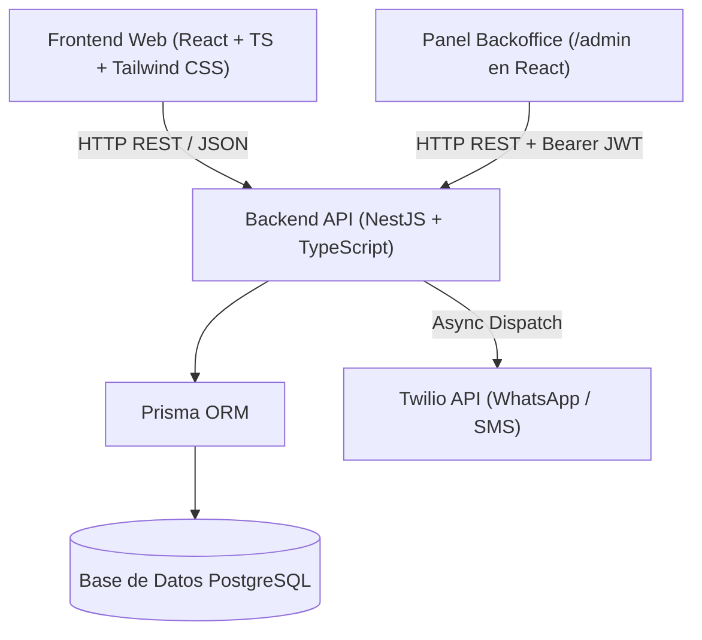

# Technical Specification (technical-spec.md)
## Proyecto: BarberRed (MVP)

**Versión:** 1.0.0  
**Estado:** Definido  
**Fecha:** 2026-09-08  
**Metodología:** Spec-Driven Development (SDD)  
**Ubicación:** `/sdd/mvp/technical-spec.md`  
**Documento Funcional Base:** [`functional-spec.md`](file:///C:/Users/estee/Documents/Proyectos/Antigravity/prueba/sdd/mvp/functional-spec.md)

---

## 1. Visión y Arquitectura General del Sistema

El sistema **BarberRed** está estructurado bajo una arquitectura cliente-servidor desacoplada que garantiza alta velocidad de respuesta, mantenimiento modular y bajo acoplamiento:



### 1.1 Decisiones de Stack Tecnológico
- **Backend:** **NestJS (TypeScript)**. Provee una arquitectura empresarial basada en controladores, servicios, inyección de dependencias y validadores (`class-validator`), ideal para escalar y estructurar reglas de negocio limpias.
- **Base de Datos & ORM:** **PostgreSQL + Prisma ORM**. Prisma es el estándar más adoptado en TypeScript, con tipado estricto end-to-end, migraciones seguras y consultas declarativas eficientes.
- **Frontend:** **React (TypeScript) + Vite + Tailwind CSS**. Ofrece un inicio ultra rápido, diseño responsivo centrado en móviles (*mobile-first* para clientes agendando desde smartphones) y componentes reutilizables.
- **Mensajería Transaccional:** **Twilio Messaging API** (WhatsApp Business Sandbox / SMS internacional).
- **Seguridad & Autenticación:**
  - *Backoffice:* JWT (JSON Web Tokens) con hashing de contraseñas mediante `bcrypt`.
  - *Clientes:* Modelo sin fricción (*Guest Checkout*); control de acceso a citas basado en identificador único de reserva (`code` ej. `BR-7291`) y verificación por número de teléfono.

---

## 2. Modelo de Datos (Data Model - Prisma Schema)

```prisma
datasource db {
  provider = "postgresql"
  url      = env("DATABASE_URL")
}

generator client {
  provider = "prisma-client-js"
}

enum AppointmentStatus {
  CONFIRMED
  CANCELLED_CLIENT
  CANCELLED_ADMIN
  COMPLETED
  NO_SHOW
}

enum NotificationChannel {
  WHATSAPP
  SMS
}

enum NotificationStatus {
  SENT
  FAILED
  PENDING
}

model AdminUser {
  id           String   @id @default(uuid())
  email        String   @unique
  passwordHash String
  name         String
  createdAt    DateTime @default(now())
  updatedAt    DateTime @updatedAt
}

model Barber {
  id             String          @id @default(uuid())
  name           String
  phone          String?
  avatarUrl      String?
  isActive       Boolean         @default(true)
  createdAt      DateTime        @default(now())
  updatedAt      DateTime        @updatedAt
  
  appointments   Appointment[]
  workingHours   WorkingHour[]
  scheduleBlocks ScheduleBlock[]
}

model WorkingHour {
  id        String   @id @default(uuid())
  barberId  String
  dayOfWeek Int      // 0 = Domingo, 1 = Lunes, ..., 6 = Sábado
  startHour Int      // Ej. 10 (10:00)
  endHour   Int      // Ej. 19 (19:00)
  isActive  Boolean  @default(true)
  
  barber    Barber   @relation(fields: [barberId], references: [id], onDelete: Cascade)

  @@unique([barberId, dayOfWeek])
}

model ScheduleBlock {
  id        String    @id @default(uuid())
  barberId  String
  date      DateTime  @db.Date
  startTime String?   // "14:00" o null si es todo el día
  reason    String?
  isFullDay Boolean   @default(false)
  createdAt DateTime  @default(now())

  barber    Barber    @relation(fields: [barberId], references: [id], onDelete: Cascade)
}

model Appointment {
  id           String            @id @default(uuid())
  code         String            @unique // Ej. "BR-9481"
  barberId     String
  clientName   String
  clientPhone  String
  clientEmail  String?
  date         DateTime          @db.Date
  startTime    String            // "10:00" (hora fija en punto)
  endTime      String            // "11:00" (45 min atención + 15 min buffer)
  status       AppointmentStatus @default(CONFIRMED)
  cancelReason String?
  createdAt    DateTime          @default(now())
  updatedAt    DateTime          @updatedAt

  barber       Barber            @relation(fields: [barberId], references: [id])
  notifications NotificationLog[]

  @@index([barberId, date])
  @@index([clientPhone])
}

model NotificationLog {
  id            String              @id @default(uuid())
  appointmentId String
  channel       NotificationChannel
  recipient     String
  messageBody   String
  status        NotificationStatus  @default(PENDING)
  externalId    String?
  errorDetails  String?
  createdAt     DateTime            @default(now())

  appointment   Appointment         @relation(fields: [appointmentId], references: [id], onDelete: Cascade)
}
```

---

## 3. Lógica del Algoritmo de Disponibilidad (Slot Engine)

Cada cita ocupa un bloque de **60 minutos** (45 min de atención + 15 min de buffer para limpieza/demoras), garantizando que las reservas inicien **en horas en punto**.

### 3.1 Pseudocódigo del Generador de Slots
Para una petición `GET /api/availability?barberId={id}&date={YYYY-MM-DD}`:

```typescript
async function getAvailableSlots(barberId: string, queryDate: Date): Promise<string[]> {
  const dayOfWeek = queryDate.getDay(); // 0 a 6

  // 1. Obtener jornada laboral del barbero para ese día
  const schedule = await prisma.workingHour.findUnique({
    where: { barberId_dayOfWeek: { barberId, dayOfWeek } }
  });
  if (!schedule || !schedule.isActive) return [];

  // 2. Verificar si hay un bloqueo de día completo
  const fullDayBlock = await prisma.scheduleBlock.findFirst({
    where: { barberId, date: queryDate, isFullDay: true }
  });
  if (fullDayBlock) return [];

  // 3. Generar slots base en horas en punto [startHour..endHour - 1]
  const candidateSlots: string[] = [];
  for (let hour = schedule.startHour; hour < schedule.endHour; hour++) {
    candidateSlots.push(`${hour.toString().padStart(2, '0')}:00`);
  }

  // 4. Obtener citas activas (CONFIRMED) y bloqueos parciales para esa fecha
  const existingAppointments = await prisma.appointment.findMany({
    where: { barberId, date: queryDate, status: 'CONFIRMED' },
    select: { startTime: true }
  });
  const partialBlocks = await prisma.scheduleBlock.findMany({
    where: { barberId, date: queryDate, isFullDay: false },
    select: { startTime: true }
  });

  const occupiedTimes = new Set([
    ...existingAppointments.map(a => a.startTime),
    ...partialBlocks.map(b => b.startTime!)
  ]);

  // 5. Filtrar ocupados y horas pasadas (si la fecha es hoy, mínimo 1h antes)
  const now = new Date();
  const isToday = queryDate.toDateString() === now.toDateString();

  return candidateSlots.filter(slot => {
    if (occupiedTimes.has(slot)) return false;
    if (isToday) {
      const [slotHour] = slot.split(':').map(Number);
      if (slotHour <= now.getHours()) return false;
    }
    return true;
  });
}
```

---

## 4. Diseño de Endpoints REST (API Specification)

### 4.1 Módulo Público (Cliente)

| Método | Endpoint | Descripción | Body / Query Params | Respuesta Exitosa |
| :--- | :--- | :--- | :--- | :--- |
| `GET` | `/api/barbers` | Lista barberos activos | - | `200 OK: Barber[]` |
| `GET` | `/api/availability` | Consulta slots disponibles | `?barberId=UUID&date=YYYY-MM-DD` | `200 OK: { slots: string[] }` |
| `POST` | `/api/appointments` | Reserva cita (Guest Checkout) | `{ barberId, date, startTime, clientName, clientPhone, clientEmail? }` | `210 Created: Appointment` |
| `GET` | `/api/appointments/lookup` | Consulta citas de un cliente | `?phone=+56912345678` | `200 OK: Appointment[]` |
| `GET` | `/api/appointments/:code` | Detalle de cita por código | Param `:code` (ej. `BR-8921`) | `200 OK: Appointment` |
| `PATCH` | `/api/appointments/:code/reschedule` | Reprogramar fecha/hora | `{ newDate, newStartTime }` | `200 OK: Appointment` |
| `POST` | `/api/appointments/:code/cancel` | Cancelar cita propia | `{ reason?: string }` | `200 OK: { success: true }` |

### 4.2 Módulo Administrativo (Protegido con Bearer JWT)

| Método | Endpoint | Descripción | Requiere Auth |
| :--- | :--- | :--- | :--- |
| `POST` | `/api/admin/auth/login` | Login de administrador | No |
| `GET` | `/api/admin/appointments` | Listar todas las citas (filtros por fecha/barbero) | Sí |
| `POST` | `/api/admin/appointments/:id/cancel`| Cancelación administrativa forzada con aviso | Sí |
| `GET` | `/api/admin/barbers` | Listado y administración de barberos | Sí |
| `PUT` | `/api/admin/barbers/:id/schedule` | Configurar jornada (`startHour`, `endHour`) | Sí |
| `POST` | `/api/admin/schedule-blocks` | Bloquear día o franja horaria | Sí |
| `DELETE`| `/api/admin/schedule-blocks/:id` | Desbloquear franja horaria | Sí |

---

## 5. Estrategia de Concurrencia y Transacciones

Para evitar reservas duplicadas en el mismo slot horario por condiciones de carrera (*race conditions*):

```typescript
// En AppointmentsService:
return await prisma.$transaction(async (tx) => {
  // 1. Validar si ya existe reserva confirmada
  const collision = await tx.appointment.findFirst({
    where: {
      barberId: dto.barberId,
      date: new Date(dto.date),
      startTime: dto.startTime,
      status: AppointmentStatus.CONFIRMED,
    },
  });

  if (collision) {
    throw new ConflictException('El horario seleccionado acaba de ser ocupado.');
  }

  // 2. Generar código alfanumérico amigable (ej: BR-4821)
  const code = `BR-${Math.floor(1000 + Math.random() * 9000)}`;

  // 3. Crear cita
  return await tx.appointment.create({
    data: {
      code,
      barberId: dto.barberId,
      date: new Date(dto.date),
      startTime: dto.startTime,
      endTime: calculateEndTime(dto.startTime), // +1 hora
      clientName: dto.clientName,
      clientPhone: dto.clientPhone,
      clientEmail: dto.clientEmail,
    },
  });
});
```

---

## 6. Servicio de Notificaciones (Twilio Integration)

- **Módulo:** `NotificationsModule` en NestJS.
- **Estrategia Asíncrona:** La notificación se despacha en segundo plano tras confirmar la transacción en base de datos para no bloquear la respuesta HTTP al cliente.
- **Canal Principal:** WhatsApp (Twilio Programmable Messaging).
- **Fallback:** SMS si el mensaje de WhatsApp retorna error de entrega.
- **Plantilla de Mensaje de Confirmación:**
  ```text
  ¡Hola {clientName}! 💈 Tu cita en BarberRed está confirmada.
  ✂️ Barbero: {barberName}
  📅 Fecha: {date}
  ⏰ Hora: {startTime}
  🔖 Código de Cita: {code}

  Puedes ver o modificar tu cita aquí:
  https://barberred.com/citas/{code}
  ```

---

## 7. Estructura del Repositorio de Código

```text
prueba/
├── backend/                  # Proyecto NestJS
│   ├── src/
│   │   ├── admin/            # Auth & Backoffice Endpoints
│   │   ├── appointments/     # Lógica de reservas y gestión
│   │   ├── availability/     # Motor de cálculo de slots
│   │   ├── barbers/          # Gestión de staff
│   │   ├── notifications/    # Integración Twilio (WhatsApp/SMS)
│   │   ├── prisma/           # PrismaService y extensiones
│   │   ├── app.module.ts
│   │   └── main.ts
│   ├── prisma/
│   │   └── schema.prisma     # Definición de tablas y migraciones
│   └── package.json
│
├── frontend/                 # Proyecto React + TypeScript (Vite)
│   ├── src/
│   │   ├── components/       # Componentes UI (Calendar, SlotPicker, Header)
│   │   ├── pages/            # Home/Booking, MisCitas, AdminDashboard
│   │   ├── services/         # Axios / Fetch client API
│   │   ├── styles/           # Tailwind CSS
│   │   └── App.tsx
│   └── package.json
│
└── sdd/                      # Especificaciones del Proyecto
    └── mvp/
        ├── functional-spec.md
        ├── technical-spec.md
        ├── design-reference.md
        └── development-plan.md
```
